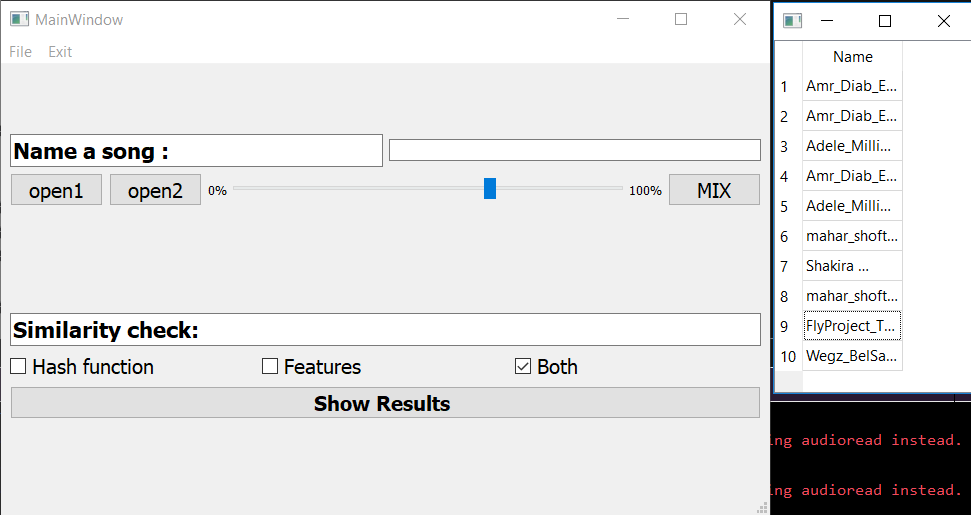

# Shazam-DSP
# Team members:
*  Abdulla elsayed 
* Mohamed Omar
* Galal hossam

# What is Shazam ?
##### it is an application that used to find songs, all that you need to give it the song or part of it and it will search for it and return for you the most similar songs in the database or the file connected with the task.

# Note
#####you should make a file of songs as a database for the application and pass its directory into shazam file in this line of init function.
"self.read_songs("your file path here")"

